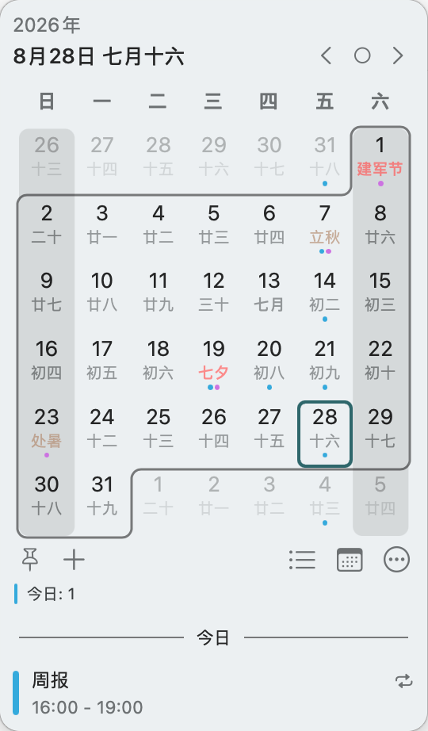

# Calendr 中国版

我在 [pakerwreah/Calendr](https://github.com/pakerwreah/Calendr) 的基础上维护本中国版，面向中文用户补充农历、节假日与二十四节气。本仓库并非原作者的官方发行。

[](https://github.com/imboni/Calendr/releases/latest)
[](https://github.com/imboni/Calendr/blob/master/Casks/calendr.rb)

- **原作者：** [Carlos Enumo (pakerwreah)](https://github.com/pakerwreah)
- **原项目：** https://github.com/pakerwreah/Calendr
- **中国版：** https://github.com/imboni/Calendr

原作以 MIT 许可证发布。本仓库保留原版权声明。如需支持原作，请前往 [原仓库](https://github.com/pakerwreah/Calendr) 或 [Buy Me a Coffee](https://buymeacoffee.com/pakerwreah)。

## 安装

### GitHub Release

从 [Releases](https://github.com/imboni/Calendr/releases/latest) 下载 `Calendr.zip`，将 `Calendr.app` 拖入「应用程序」。首次打开若被拦截，可在 Finder 中右键选择「打开」，或执行：

```bash
xattr -cr /Applications/Calendr.app
```

应用内检查更新会读取本仓库的最新 Release。

### Homebrew

```bash
brew tap imboni/calendr https://github.com/imboni/Calendr
brew install --cask calendr
```

## 界面



## 相对原作的改动

原作已于 [v1.25.0](https://github.com/pakerwreah/Calendr/releases/tag/v1.25.0)（2026-08-30）加入中文农历日期（日期格与菜单栏）及二十四节气，两项功能均可独立开关，默认对中文区域开启；相关实现来自 [#759](https://github.com/pakerwreah/Calendr/pull/759)。

原作又于 2026-08-31 合入年份与月份选择器（[#761](https://github.com/pakerwreah/Calendr/pull/761)，现位于 master 分支，尚未发布 Release）：点击日历标题可弹出紧凑的选择面板，面板中包含年份步进器（支持 2000–2100）与 3×4 月份缩写网格（Jan–Dec）；该面板叠加显示，不替换日期格。

本中国版在此基础上继续提供以下功能：

- **中国大陆节假日名称：** 日期格可显示节假日，法定休息日辅以浅色底纹
- **独立风格的年月选择器：** 点击标题年份选择年份，点击日期选择月份；选择器覆盖日期格为等大单元格，选年时左右箭头按 12 年翻页
- **农历、节假日、节气分项开关：** 设置中可分别控制；全部关闭时，日期格布局与原作关闭农历时一致
- **默认开启：** 本版中上述选项默认开启

## 版本与发布

版本号为 `MARKETING_VERSION`（当前 1.25.1）。GitHub Release 名称为 `v` 前缀，须与应用内版本一致（例如 `v1.25.1`），以便应用内检查更新。

发布流程：

1. 同步更新 `assemble.env` 与 Xcode 工程中的 `MARKETING_VERSION`
2. 打 tag 并推送：`git tag v1.25.1 && git push origin v1.25.1`
3. GitHub Actions `Release` 工作流会构建 `Calendr.app`、上传 `Calendr.zip`，并更新 `Casks/calendr.rb` 的版本与校验和

其余功能（中国大陆节假日与独立风格的年月选择器）仅维护于本仓库。

## 原作功能

[Calendr](https://github.com/pakerwreah/Calendr) 是一款 macOS 菜单栏日历。以下功能来自原作。

### 自然语言新建事件

在标题中一并输入日期、时间、时长、全天或日历指示，Calendr 会在输入时高亮已识别内容，并同步更新事件字段；保存时这些指示会从标题中移除。

示例：

`Pickleball with Tom next Friday from 10 to 12 /sport`

- 日期：`today`、`tomorrow`、`yesterday`、`in a week`、`in 3 days`、`on Friday`、`next Friday`、`August 12`
- 时间：`at 14`、`at 2pm`、`at noon`、`tomorrow morning`、`from 10 to 12`、`at 22 until 1`
- 相对开始与时长：`in 2 hours`、`for 30 minutes`、`for 2 hours`、`for 4 days`
- 全天：`all day`、`full day`
- 日历：以 `/` 后接日历名称片段，如 `/sport`，进行模糊匹配

目前支持英语与捷克语指示。解析器随 Calendr 的首选语言自动选择；其他语言仍可选用英语解析器。该功能可在设置中开关，英语与捷克语环境下默认开启。数字日期顺序遵循当前区域设置；标题的首个词始终保留为事件名称。


### 菜单栏显示多个时区

格式：

`HH:mm | HH:mm@GMT+2 'LT' | HH:mm@GMT-3 'BR'`

结果：

`15:00 | 17:00 LT | 12:00 BR`

### URL Scheme 打开指定日期

说明见原项目：https://github.com/pakerwreah/Calendr/issues/314

| 日期 | 编码后的 URL |
| --- | --- |
| `december` | `calendr://date/december`（默认当前日与年） |
| `feb 10 2025` | `calendr://date/feb%2010%202025` |
| `2nd of September 2025` | `calendr://date/2nd%20of%20September%202025` |

相对日期仅有限支持 `today`、`yesterday`、`tomorrow`，不支持 `next week`、`last month` 等。此限制来自 `NSDataDetector`。
